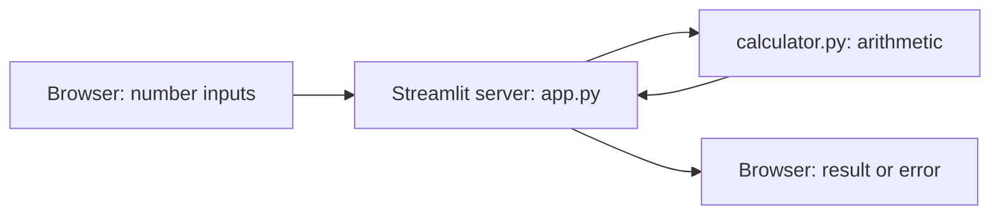
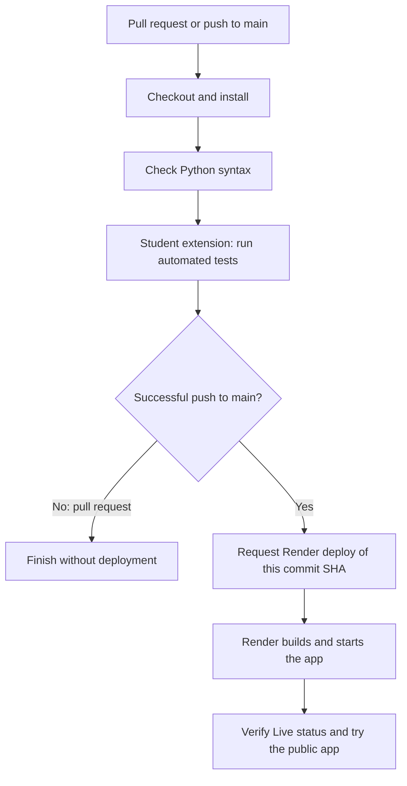

# A Python calculator: from local app to CI/CD

## Start here: the simple testing lesson

The current starter runs only **two ordinary tests**: `multiply(6, 4) == 24` and `divide(12, 3) == 4`. The additional cases and interface tests are preserved as comments. The division-by-zero guard in `calculator.py` is also commented out intentionally.

1. Run `python -m unittest -v` using your project environment: the two tests pass.
2. In `test_calculator.py`, uncomment the three lines of `test_divide_by_zero`, retaining their indentation. Run again: the new test errors with `ZeroDivisionError` because it expects the agreed `ValueError` instead. Two passing examples did not prove every input works.
3. Let students fix the function by uncommenting the `if b == 0` and `raise ValueError(...)` lines in `calculator.py`. Run again: **three tests pass**.
4. Later, uncomment the extra numeric assertions, the `AppTest` import, and the complete `InterfaceTests` class to reach the **five-test baseline** described in the original walkthrough below. Remove only the leading comment marker added to disable code, preserving the original indentation and explanatory comments.

Until step 3, entering a zero denominator in the UI raises an unhandled `ZeroDivisionError`; its existing `except ValueError` is intentionally insufficient. Keep this deliberate defect local for the lesson and restore the guard before deploying. The explanations below describe the restored guard and five-test version.

This classroom project has two rows: multiplication with two number inputs and its result, then division with two number inputs and its result. Both the interface definition and calculation functions are Python. Start with this working app; students then add power and make automated tests a deployment requirement.

**Audience:** students who know variables, functions, `if`, and basic terminal commands. Allow about 45–60 minutes for the demonstration and 60–90 minutes for the exercise, plus account setup. You need Python (3.12 recommended), Git, a browser, and GitHub and Render accounts for the deployment portion. You can complete the local work without those accounts.

## Read in this order

1. This guide: run the starter, understand its lines, and configure deployment.
2. [Student lab](STUDENT_LAB.md): add power, test it, and update CI/CD.
3. [Instructor answers](INSTRUCTOR_ANSWERS.md): worked solutions and assessment. Withhold this file if distributing an unsolved assignment.

## 1. Why this stack?

The immediate task is to let someone enter numbers in a browser and see calculated answers. A command-line program cannot supply that interface. Streamlit provides Python functions that declare browser widgets while calculations execute on the server. It fits a small calculator, teaching demo, or data tool. It is less suitable when you need full control over every browser interaction or a public REST API. [Streamlit architecture](https://docs.streamlit.io/develop/concepts/architecture/architecture)

| Approach | Fit for this lesson | Trade-off |
|---|---|---|
| Streamlit + Python functions | One framework, one application server, Python-authored UI | Streamlit controls rendering and reruns |
| Flask + HTML forms | Useful when teaching HTTP routes and templates | Students also need HTML and request handling |
| FastAPI + a separate JavaScript UI | Useful when independent clients need an API | Adds a second language and separate frontend tooling |

These are teaching recommendations, not performance rankings. A future Flask implementation could call the same `divide(a, b)` from a route; the arithmetic tests would still apply, while interface tests would change.

The frontend is like an order form and the backend is the person calculating the order. Here they share one Python application, so we do not need to invent an HTTP API between our own modules. The analogy has a limit: the browser still communicates over the network with Streamlit, and does not execute these Python functions itself. “Both in Python” means we author both sides in Python; Streamlit supplies browser-side technology internally.



This editable diagram describes one running server process, not three services. Two source files separate responsibilities without requiring separate servers, a database, Docker, or a frontend build.

## 2. Know the files

| File | Purpose |
|---|---|
| `app.py` | Python interface and calls into calculation logic |
| `calculator.py` | Multiplication and division functions, independent of Streamlit |
| `test_calculator.py` | Five baseline backend/interface tests for local verification |
| `requirements.txt` | One direct dependency: `streamlit==1.64.0` |
| `.python-version` | `3.12`, selecting the Python minor version on Render |
| `.github/workflows/deploy.yml` | Syntax check, then a deployment request on pushes to `main` |
| `.gitignore` | Keeps the virtual environment, Python cache, and local secrets out of Git |

The source and workflow have comments explaining each substantive line. Blank lines only separate ideas. `#` begins a comment in Python and YAML. Markdown files are documentation and are not executed by the application.

The five `.gitignore` lines respectively exclude the `.venv` environment directory, Python's `__pycache__` directories, compiled `.pyc` files, a local `.env` file, and Streamlit's local secrets file. Ignoring a path prevents new matching files from being staged; it does not remove a secret that was already committed.

The Streamlit version is pinned for a consistent lesson. Its transitive dependencies and Python patch version are not fully locked; this is not a byte-for-byte reproducible release build. Streamlit 1.64.0 declares Python >=3.10. [Package metadata](https://pypi.org/project/streamlit/1.64.0/)

## 3. Run the app locally

Open a terminal **inside the `python-calculator-classroom` folder**. On Windows PowerShell:

```powershell
python -m venv .venv
.\.venv\Scripts\python.exe -m pip install -r requirements.txt
.\.venv\Scripts\python.exe -m streamlit run app.py
```

| Command | What each part means |
|---|---|
| `python -m venv .venv` | `python` selects your installed interpreter; `-m` runs a module; `venv` creates an isolated environment; `.venv` is its folder. |
| `.\.venv\Scripts\python.exe -m pip install -r requirements.txt` | Use the environment's interpreter; run its `pip` installer; `install` adds packages; `-r` reads the dependency file. |
| `.\.venv\Scripts\python.exe -m streamlit run app.py` | Use the same interpreter; run Streamlit; `run` starts its server with `app.py` as the entrypoint. |

No PowerShell activation is needed. On macOS/Linux, use `python3 -m venv .venv`, then `.venv/bin/python -m pip install -r requirements.txt` and `.venv/bin/python -m streamlit run app.py`. The rest of the commands in this guide use the Windows environment path; substitute `.venv/bin/python` on those platforms.

Open [localhost:8501](http://localhost:8501) while the server is running. Stop it with Ctrl+C in its terminal. On a wide screen each operation occupies a row with two inputs and its result; columns may stack on small screens so controls remain usable. [Column layout documentation](https://docs.streamlit.io/develop/api-reference/layout/st.columns)

Expected first view:

```text
Multiplication
First factor [6]     Second factor [4]     Product 24

Division
Numerator [12]       Denominator [3]       Quotient 4
```

Try `7 × 4`, `12 ÷ 0`, and then `12 ÷ 4`. Expect `28`, a readable error, and `3`. A result updates when the widget commits its value, such as after pressing Enter or leaving the field. There is no Calculate button.

## 4. Understand the backend line by line

Open [calculator.py](calculator.py). It has two small functions:

| Line or expression | Meaning and purpose |
|---|---|
| `def multiply(a: float, b: float) -> float:` | `def` creates a function; `a` and `b` are parameters; `float` and `-> float` document numeric inputs and a numeric result. Type hints do not validate values at runtime. The colon starts an indented body. |
| `return a * b` | Multiply and hand the result back to the caller. `return` does not print anything. |
| `def divide(a: float, b: float) -> float:` | Create a separate function for division using the same parameter pattern. |
| `if b == 0:` | Compare the denominator with zero. `==` compares; `=` assigns. Both `0.0` and `-0.0` count as zero. |
| `raise ValueError("Cannot divide by zero.")` | Stop this calculation with an expected error that the interface can catch. This is part of the backend's behavior, so every caller gets the same rule. |
| `return a / b` | Divide only after the invalid case has been excluded. `/` returns ordinary division; `//` would mean floor division. |

These functions accept numeric values supplied by the controlled UI. They are not public endpoints and do not parse arbitrary strings. If a future API accepts user text, validate and convert it at that boundary. Decimal inputs use binary floating point: this is a classroom calculator, not an exact money calculator.

**Trace checkpoint T1:** For `divide(12, 0)`, which line never executes? Explain before consulting the answer key.

## 5. Understand the interface line by line

Open [app.py](app.py), whose inline comments explain every line. Read it in four sections:

**Imports and page setup.** `import streamlit as st` lets us write `st.title` instead of `streamlit.title`. `from calculator import ...` imports our backend functions without starting another server. `set_page_config` sets the browser title and wide layout; `title` and `caption` render visible text.

**Multiplication row.** `subheader` names the operation. `left, middle, right = st.columns(3)` unpacks three containers. Calling a container's method puts a widget inside that container. The positional arguments to `number_input` are its label, minimum, maximum, and default value. `-1e6` and `1e6` mean -1,000,000 and 1,000,000. Float defaults such as `6.0` make these decimal-capable controls. Each `key` uniquely identifies a widget across reruns and lets tests select it by name. Visible labels help users identify the inputs. [Number input reference](https://docs.streamlit.io/develop/api-reference/widgets/st.number_input)

`right.metric("Product", f"{multiply(a, b):g}")` first calls the backend with the two values. The `f` marks a formatted string; braces contain the expression; `:g` uses general numeric formatting, removing unnecessary trailing zeros. General formatting defaults to six significant digits, so the displayed result can be rounded or shown in scientific notation. The full floating-point value is still what the backend computes. `metric` displays a label and a value.

**Division row.** A second `st.columns(3)` creates a new row. Reusing the Python variables `a`, `b`, and the container names is safe: the first result has already been rendered, and distinct widget keys preserve distinct input values. `divide_a` is the numerator and `divide_b` the denominator.

**Error handling.** `try` surrounds the calculation that can fail. `except ValueError as error` handles the specific expected error and binds it to `error`. `str(error)` converts it to display text; `right.error` renders that message in the result column. Other unexpected exceptions are not silently hidden. When the denominator is corrected, Streamlit reruns the script and displays the new result.

**Trace checkpoint T2:** After changing the first factor to 7, which backend function receives 7, and why does the division denominator retain its own value?

## 6. Verify the starter

In a second terminal in the same folder:

```powershell
.\.venv\Scripts\python.exe -m unittest discover -s . -p "test_*.py" -v
```

`unittest` is Python's built-in test framework. `discover` finds tests; `-s .` starts in the current folder; `-p "test_*.py"` selects filenames; `-v` prints each test's name. Expect **5 tests** and `OK`. A failure returns a nonzero process exit code, which CI can use to stop deployment. [Python unittest documentation](https://docs.python.org/3/library/unittest.html)

Open [test_calculator.py](test_calculator.py). Its comments explain the lines. A class inheriting `unittest.TestCase` groups tests, and methods named `test_...` are discovered automatically. `self` refers to the running test object. A `for` loop checks several multiplication examples; tuple unpacking gives each example's operands and expected result; `subTest` labels individual cases. `assertEqual` checks exact equality, `assertAlmostEqual` tolerates tiny numeric differences, and `assertRaisesRegex` checks both exception type and message. The `with` statement applies the assertion to its indented call.

`AppTest.from_file("app.py").run()` executes the actual Streamlit script in a simulated session. Selecting a widget by `key`, setting its value, then calling `.run()` simulates an edit. `app.exception` holds unhandled app errors; `app.error` holds intentionally rendered error messages. `app.metric[0]` is the first result. `[m.value for m in app.metric]` collects all displayed metric values. AppTest checks interface behavior without launching a real browser; it does not verify pixel layout or accessibility in a browser. [Streamlit AppTest](https://docs.streamlit.io/develop/api-reference/app-testing/st.testing.v1.apptest)

Finally, `if __name__ == "__main__":` permits direct execution with `python test_calculator.py`; it does not start the runner during test discovery imports.

## 7. Understand the deployment workflow

CI means automatically checking changes. CD here means automatically requesting deployment after those checks succeed on `main`. GitHub Actions is the automation runner; Render is where the long-running app is hosted. Actions does not keep the web server alive after the job ends.



The starter intentionally has **syntax checking but no automated test step in CI yet**. Its tests already run locally. The student task is to wire those tests, plus new power tests, into the workflow. A syntax check will accept `return a + b` even when multiplication was intended; this limitation motivates behavioral testing. Do not treat the starter workflow as a complete test gate.

Open [.github/workflows/deploy.yml](.github/workflows/deploy.yml). Every YAML line is annotated. Read the sections in this order:

| Section | What it accomplishes |
|---|---|
| `name` and `on` | Name the workflow and select pushes to `main` and pull requests targeting `main`. |
| `permissions` | Give the automatic GitHub token read-only repository contents access. |
| `jobs`, `runs-on`, `timeout-minutes` | Define one ordered job on a hosted Linux runner, bounded to ten minutes. |
| Checkout and Python setup | Obtain source and select Python 3.12. `uses` invokes an existing action; `with` supplies its inputs. |
| Dependency installation | Install the package specified in `requirements.txt` on this fresh machine. |
| Syntax check | `compileall` compiles the named Python files; `-q` suppresses routine file listings. It does not run arithmetic or UI tests. |
| Deployment condition | The `if` expression allows only a push to `refs/heads/main`. With normal step behavior, an earlier failure also prevents this step. |
| `env` and `run` | Supply the secret as an environment variable and run Bash commands. `run: \|` introduces a multiline YAML string. |

YAML uses spaces for nesting; `-` begins a list item. GitHub expressions such as `${{ secrets.RENDER_DEPLOY_HOOK_URL }}` are evaluated by Actions. Shell expressions such as `${DEPLOY_HOOK}` are expanded later by Bash. The runner's shell is Bash even when you developed on Windows. Workflow syntax is documented by [GitHub](https://docs.github.com/en/actions/reference/workflows-and-actions/workflow-syntax).

The first shell line is:

```bash
test -n "$DEPLOY_HOOK" || { echo "Missing RENDER_DEPLOY_HOOK_URL secret"; exit 1; }
```

`test -n` succeeds only when the variable is nonempty. Quotes preserve the URL as one string. `||` runs the braced commands if the test fails. `echo` prints a useful message; `exit 1` fails the step. Semicolons separate the commands in the braces. No secret value is printed.

The second shell line is:

```bash
curl --fail --silent --show-error --max-time 60 --output /dev/null "${DEPLOY_HOOK}&ref=${GITHUB_SHA}"
```

`curl` sends an HTTP GET request. `--fail` makes HTTP errors fail the command, `--silent` hides progress, `--show-error` retains errors, `--max-time 60` bounds the request in seconds, and `--output /dev/null` discards the response body. `GITHUB_SHA` is supplied by GitHub. Appending `&ref=...` requests the exact checked commit, instead of whichever revision is newest later. This assumes the full Render hook URL, which already includes a `?key=...` query string, was copied unchanged into the secret. [Render deploy hooks](https://render.com/docs/deploy-hooks)

**A green Actions run means the deployment request was accepted, not that the new app is already live.** Render builds asynchronously. Inspect its deploy status and commit SHA, then check the app. A classroom project does not need a custom polling system; production release automation may need one. Avoid overlapping demonstration deployments while learning this flow.

## 8. Set up GitHub and Render

These are instructions to perform in your own accounts; the supplied project has not been published.

### A. Put this folder at the repository root

Create an empty GitHub repository named `python-calculator-classroom`. Do not initialize it with a README if following these exact commands. In this project folder, run:

```powershell
git init -b main
git add .
git commit -m "Add calculator starter"
git remote add origin https://github.com/YOUR_USERNAME/python-calculator-classroom.git
git push -u origin main
```

Replace `YOUR_USERNAME`. Respectively, these lines create a repository on `main`, stage nonignored files, record a snapshot, save the GitHub URL as `origin`, and upload the branch while remembering its upstream. Git may first request your name/email and GitHub authentication. Do not run these commands from the parent folder containing unrelated teaching files.

The `.github` folder must be at the GitHub repository root. The first Actions run can pass syntax checking and fail deployment because the secret is not configured yet; complete the next steps and rerun it. Do not weaken the missing-secret check to hide a setup problem.

### B. Create the hosting service

In Render, choose **New → Web Service**, connect GitHub, and select this repository. Enter:

| Setting | Value |
|---|---|
| Runtime / Language | Python |
| Branch | `main` |
| Root directory | Leave blank: this project is the repository root |
| Build command | `python -m pip install -r requirements.txt` |
| Start command | `python -m streamlit run app.py --server.address=0.0.0.0 --server.port=$PORT --server.headless=true` |
| Auto-Deploy | **Off** |

The start command runs the application; `0.0.0.0` binds the public-facing server interface, `$PORT` uses Render's assigned port, and headless mode avoids trying to open a browser on the server. This command runs on Render's Linux host, so enter `$PORT` literally in Render's dashboard. [Render web service setup](https://render.com/docs/web-services)

The included `.python-version` selects Python 3.12 and lets Render choose its patch version. Avoid setting a conflicting `PYTHON_VERSION` environment variable, which has higher precedence. [Render Python versions](https://render.com/docs/python-version)

Choose a compute plan after checking its current price and limitations in your account. This guide does not promise free hosting. Creating the service starts an initial deployment; subsequent deployments should come through Actions. Keep **Auto-Deploy Off** so Render cannot deploy a push independently of the test gate students will add. [Render deployment settings](https://render.com/docs/deploys)

### C. Configure the secret and exercise deployment

1. In Render service settings, copy the complete **Deploy Hook** URL.
2. In the GitHub repository, open **Settings → Secrets and variables → Actions → New repository secret**.
3. Name it exactly `RENDER_DEPLOY_HOOK_URL` and paste the URL as its value. Never put it in a committed file or screenshot.
4. In GitHub's **Actions** tab, open the initial workflow run and choose **Re-run all jobs**. After setup, later pushes to `main` will request deployment automatically.
5. Inspect the successful request step. Then check Render until the corresponding commit is **Live**; an accepted hook alone is not proof of a working deployment.
6. Open Render's public URL and repeat `6 × 4 = 24`, `12 ÷ 3 = 4`, and the zero-denominator recovery check.

If GitHub Actions is disabled by repository/organization policy, enable it through the permitted settings or ask the repository owner. A Render failure is investigated in Render's build/runtime logs; an Actions failure is investigated in the failing job step.

## 9. Common problems

| Symptom | Check or fix |
|---|---|
| `No module named streamlit` | Install requirements with the same `.venv` interpreter used to launch the app. |
| AppTest cannot find `app.py` | Run tests from the project root. |
| Zero tests run | Keep filename `test_calculator.py` and `test_` method prefixes; inspect the discovery command. |
| Port 8501 already in use | Stop the existing app, or add `--server.port=8502` locally. |
| Workflow never appears | Commit `.github/workflows/deploy.yml` at the repository root and check the branch/event. |
| Missing deployment secret | Add the repository secret with the exact name, then rerun the workflow. |
| Hook request fails | Verify the complete secret URL and service state; regenerate and update the secret if needed. |
| Actions green but app still old | Wait for Render, inspect the deployed commit, and inspect build/runtime errors. |
| Render deploys despite failed tests | Turn off Render Auto-Deploy; confirm the test step precedes the hook and has no `continue-on-error`. |

## 10. Research and verification record

Official documentation was consulted on **2026-09-30**. Selected versions: Streamlit 1.64.0, Python 3.12 for CI/Render, and major version 7 of the official [checkout](https://github.com/actions/checkout) and [setup-python](https://github.com/actions/setup-python) actions. Action major tags can receive upstream updates; a production repository may choose reviewed commit-SHA pins.

Local execution results are recorded in [VERIFICATION.md](VERIFICATION.md). Cloud deployment requires the account configuration above and is not claimed as executed. The diagrams here are editable Mermaid source; no PDF or slide deck is included.
